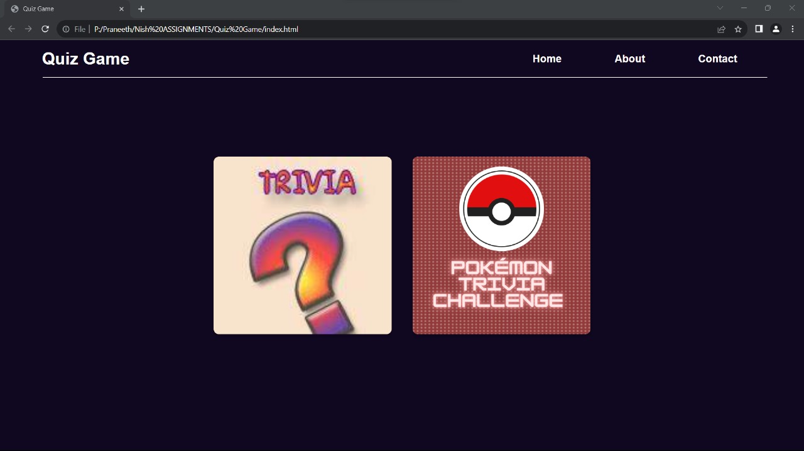
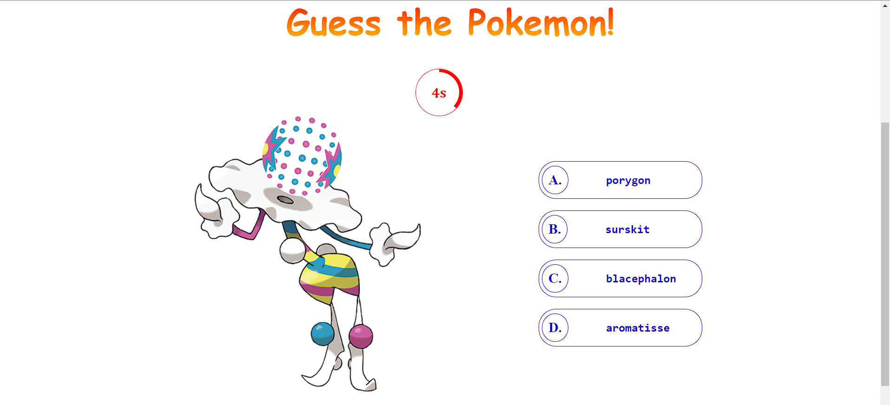

# Pokémon and Trivia Quiz Game

Welcome to the Pokémon and Trivia Quiz Game! Test your knowledge and have fun with quizzes about Pokémon and various trivia topics and top our leaderboard.

## Table of Contents
- [Features](#features)
- [Screenshots](#screenshots)
- [How to Play](#how-to-play)
- [Technologies Used](#technologies-used)
- [Contributing](#contributing)
- [License](#license)

## Features

- Choose between Pokémon Quiz and Trivia Quiz.
- Pokémon Quiz features questions about Pokémon species, types, and more.
- Trivia Quiz (under production) will include a variety of trivia questions on different topics.
- Interactive and user-friendly interface.

## Screenshots

### Home Page

### Pokémon Quiz

### Trivia Quiz (Coming Soon)

## How to Play

1. Open the [Game Website(Coming Soon)](#)
2. Choose your desired quiz: Pokémon or Trivia (Coming Soon).
3. Answer the questions and test your knowledge!
4. Enjoy the interactive experience.

## Technologies Used

- HTML
- CSS
- JavaScript

## Contributing

Contributions are welcome! Feel free to open issues or submit pull requests. For major changes, please open an issue first to discuss what you would like to change.

## License

This project is licensed under the [MIT License](LICENSE).
